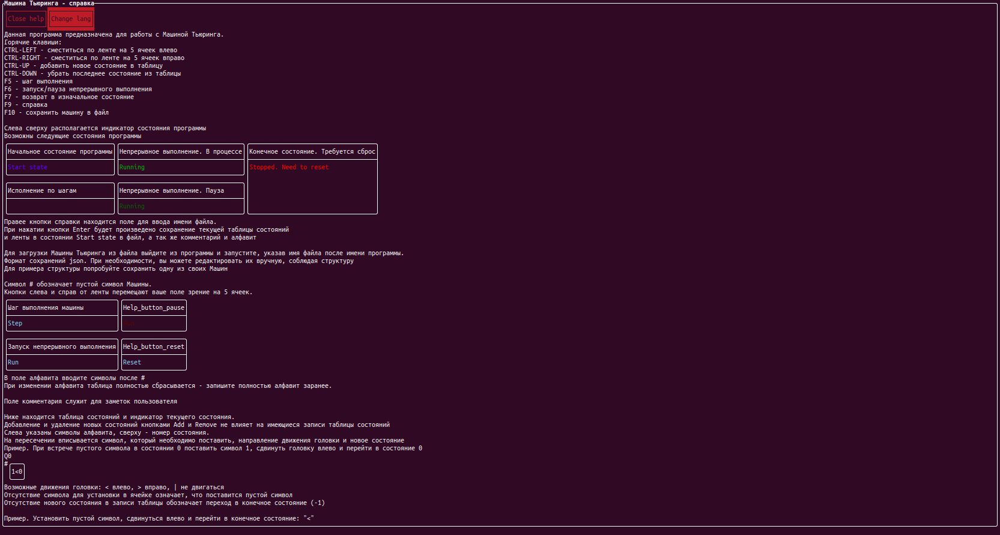

<a name="turing-cmd"/>

# turing_cmd

Машина Тьюринга с интерфейсом в командной строке.

## Table of contents
- [turing_cmd](#turing-cmd)
  * [Возможности](#features)
    + [Пример загрузки и сохранения программы](#example-of-save-load)
    + [Полный текст справки](#full-reference-text)
  * [Известные проблемы](#known-issues)
  * [Установка](#installation)
    + [Ubuntu/Debian](#ubuntu-debian)
  * [Сборка](#build)
  * [Спасибо создателям библиотек](#thanks-for-libraries-creators)
  * [История изменений](#changelog)

<a name="features"/>

## Возможности:
- Бесконечная лента
- Пошаговое выполнение
- Непрерывное выполнение
- Сохранение Машины в файл и загрузка из файла.

<a name="example-of-save-load"/>

### Пример загрузки и сохранения программы:

Возможна навигация стрелками и мышкой, выход на Esc. Присутствуют горячие клавиши.

<a name="full-reference-text"/>

### Полный текст справки:
 

<a name="known-issues"/>

## Известные проблемы:
- Сохранения с кириллицей и/или широкими символами (греческие и т.п.) работают не всегда корректно (По этой причине в сохранеии лямбда заменена знаком #). Применяйте, пожалуйста, на данный момент числа и латиницу

<a name="installation"/>

## Установка

Вы можете использовать скомпилированную версию из [релизов](https://github.com/DanArmor/turing_cmd/releases) (пока только для Linux).

<a name="ubuntu-debian"/>

### Ubuntu/Debian:
[Имеется PPA репозиторий.](https://launchpad.net/~danarmor/+archive/ubuntu/ppa).
* `sudo add-apt-repository ppa:danarmor/ppa`
* `sudo apt update`
* `sudo apt install turing-cmd`
Готово - вы можете запустить программу командой `turing-cmd` в терминале.

<a name="build"/>

## Сборка:
Программа имеет две зависимости, указанные в конце Readme, но если у вас имеется CMake - достаточно создать каталог build и запусть run.sh, или запустить CMake/make вручную - файл CMakeLists уже настроен так, чтобы скачать необходимые зависимости.

<a name="thanks-for-libraries-creators"/>

## Спасибо создателям библиотек:
- [nlohmann/json](https://github.com/nlohmann/json) - работа с JSON (текущая библиотека)
- [ArthurSonzogni/FTXUI](https://github.com/ArthurSonzogni/FTXUI) - TUI
- [taocpp/json](https://github.com/taocpp/json) - работа с JSON (была использована в первой версии)

<a name="changelog"/>

## История изменений:

V0.2.1 - FTXUI 4.0.0

v0.2 - переход на новую библиотеку json, переход с wchar/wstring, изменение save/load уведомления, переход на FTXUI V3.0.0

v0.1 - первая версия
