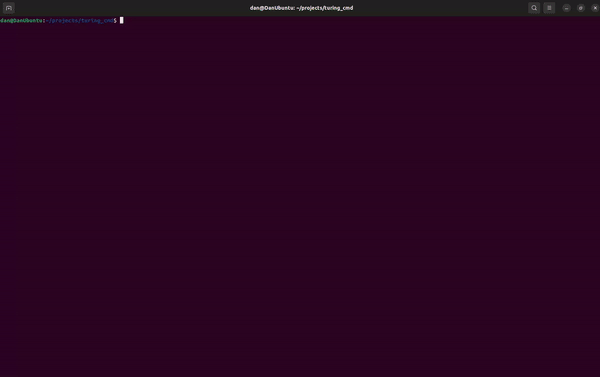

# turing_cmd

Машина Тьюринга с интерфейсом в командной строке.

## Возможности:
- Бесконечная лента
- Пошаговое выполнение
- Непрерывное выполнение
- Сохранение Машины в файл и загрузка из файла.

### Пример загрузки и сохранения программы

Возможна навигация стрелками и мышкой, выход на Esc. Присутствуют горячие клавиши.

### Полный текст справки
 

## Известные проблемы:
- Сохранения с кириллицей и/или широкими символами (греческие и т.п.) работают не всегда корректно (По этой причине в сохранеии лямбда заменена знаком #). Применяйте, пожалуйста, на данный момент числа и латиницу

## Сборка:
Программа имеет две зависимости, указанные в конце Readme, но если у вас имеется CMake - достаточно создать каталог build и запусть run.sh, или запустить CMake/make вручную - файл CMakeLists уже настроен так, чтобы скачать необходимые зависимости.

Примечание: в проекте используется FTXUI версии 2, на момент написания уже существует версия 3

## Спасибо создателям библиотек:
- [nlohmann/json](https://github.com/nlohmann/json) - работа с JSON (текущая библиотека)
- [ArthurSonzogni/FTXUI](https://github.com/ArthurSonzogni/FTXUI) - TUI
- [taocpp/json](https://github.com/taocpp/json) - работа с JSON (была использована в первой версии)
